# Architecture

SkillDNA is a local TypeScript application embedded in a VS Code extension. The browser preview runs the same domain services, but synthetic data stays in memory and filesystem operations are unavailable.

```mermaid
flowchart LR
  Sources[Demo / consented session discovery / metadata] --> Normalize[Allowlist and redaction]
  Normalize --> Pending[In-memory normalized preview]
  Pending --> Approval[Session approval]
  Approval --> Store[Extension-local JSON repository]
  Store --> Mine[Sequence miner and heuristic scoring]
  Mine --> Review[Workflow review]
  Review --> Draft[Deterministic skill generator]
  Draft --> Edit[Editable files and sections]
  Edit --> Validate[YAML and privacy validation]
  Validate --> Confirm[Native destination confirmation]
  Confirm --> Export[Project-scoped skill folder]
```

## Ownership

- `apps/extension`: activation, supported VS Code APIs, native consent/export dialogs, command registration, webview lifecycle.
- `apps/webview`: React dashboard, workflow explorer, normalized session review, draft editor, privacy center.
- `packages/domain`: versioned contracts and Zod message validation.
- `packages/application`: shared application state transitions and feedback handling.
- `packages/adapters`: scoped filesystem discovery, JSON/JSONL parser, and validated VS Code mutation-log reconstruction.
- `packages/privacy`: typed-placeholder redaction, allowlisted normalization, deterministic classification.
- `packages/workflow-engine`: explainable segmentation, sequence mining, clustering, scoring.
- `packages/skill-generator`: deterministic generation, YAML validation, safe filesystem export.
- `packages/storage`: local JSON repository abstraction with serialized writes and atomic replacement.

## Trust boundaries

Import files are explicitly selected and size-limited. Raw text is temporary, redacted locally for keyword classification, and never included in persisted events. Import-provided IDs become opaque batch/session IDs. Pending observations are never saved automatically. Synthetic and real sessions are not clustered together.

Webview messages cross an untrusted boundary: Zod validates commands and payload sizes. The host serializes state operations. CSP forbids network connections and remote scripts. No terminal execution or arbitrary filesystem command is exposed. Workspace trust is required for imports, observation, and skill export.

The native host selects a destination workspace, confirms the exact saved approved draft, reruns validation, and refuses existing directories, traversal, reserved filenames, and symlink destinations. Validation does not guarantee generated instructions are semantically safe. Local malware capable of concurrent filesystem mutation is outside the MVP threat model.

## Mining and scoring

The miner removes configurable noise, collapses adjacent equivalent events, and preserves order. It enumerates bounded contiguous sequences and counts distinct session support, then removes strict subsets with no greater support. Whole normalized sessions are clustered against deterministic representatives using normalized Levenshtein similarity (default 0.55). Clusters include observed variations; step occurrence at or above 80% is stable. Steps below that threshold remain optional. Predecessors, successors, entry points, blocked exits, source categories, and three normalized representative examples remain inspectable.

This is an explainable hackathon heuristic, not general process discovery: long sessions containing multiple unrelated workflows should be segmented first. A step appearing repeatedly in one session is collapsed in the graph view; iteration semantics are not inferred. At most 500 sessions with 200 events each are analyzed synchronously. The `WorkflowMiner` interface permits replacing the algorithm later.

Scores are separate 0-100 heuristic factors: repetition, stability, effort, context switches, standardization, output consistency, validation availability, privacy risk, destructive risk, judgment dependency, feedback, and intent confidence. The overall score is a weighted positive sum minus risks; exact weights and recommendation gates are in `scoring.ts`. Effort uses observed duration or a disclosed 30-second fallback. Privacy/destructive estimates are lower bounds, not certification. Frequency alone never determines the recommendation.

## Generation and persistence

Generation uses curated intent-specific evidence/artifact instructions, never raw prompts or imported examples. Given the same candidate and supplied date it is deterministic. It creates SKILL.md, a Mermaid graph, and a result template. No executable scripts are generated. Section and full-file edits are supported. Critical validation findings prevent draft persistence and export; warnings remain reviewable.

The repository stores schema v1 settings, consent, sessions/events, candidates, drafts, feedback, and content-free audits. Unsupported/corrupt storage is blocked until an explicit reset; it is never silently overwritten. Pending sessions live only in memory. Observation is paused on activation. Retention is applied on activation and settings updates; derived data is cleared when source sessions expire. All-data deletion removes the storage file and clears consent and pending memory without recreating an audit file.

## Integration points

`InteractionSource` is the adapter contract. Live VS Code metadata delivers normalized events by callback; scoped import and demo return batches. The owned participant handles `/analyze`, `/candidates`, `/explain`, `/generate`, and `/validate` without recording interactions. Legacy chat-source values remain readable for historical records, but cannot be enabled or resumed. Deterministic rule/keyword classification remains the only classifier.

Optional suitability review uses `vscode.lm` in the native host after separate session-scoped consent. `CopilotReviewQueue` owns bounded asynchronous requests, cancellation, strict response validation and an in-memory cache; `reviewSummary` projects only approved categorical evidence. Reviews are added to dashboard snapshots, not persisted application state. AI opinions never mutate local recommendations, draft generation, or export gates. Background completion preserves the currently selected dashboard view. Browser preview cannot enable model access. Explicit analysis triggers review; live observation does not.
